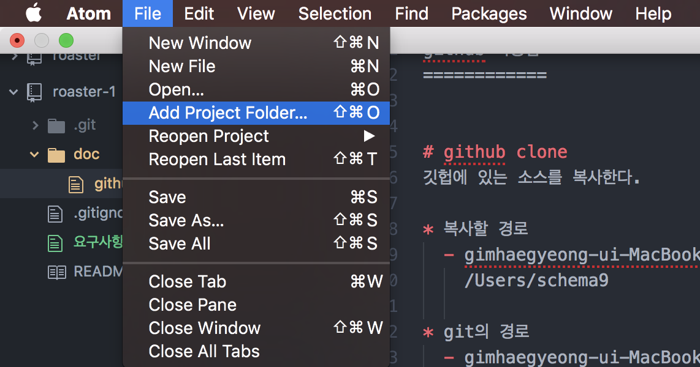
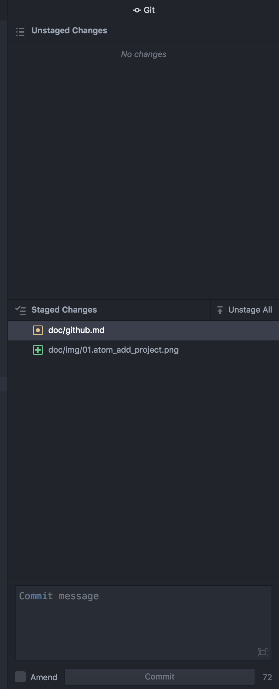

github 사용법
============

## github clone #
깃헙에 있는 소스를 복사한다.

* 복사할 경로

    <code>
    gimhaegyeong-ui-MacBook-Pro:~ schema9$ pwd
    /Users/schema9
    </code>

* git의 경로

  <code>
  gimhaegyeong-ui-MacBook-Pro:~ schema9$ which git
    /usr/bin/git
  </code>

* 복사할 github의 경로를 입력하고 명령어를 실행하면 소스를 복사해온다.

  <code>
  gimhaegyeong-ui-MacBook-Pro:~ schema9$ git clone https://github.com/kimhaegyeong/roaster-1
  </code>

## atom 에서 github 연동하기 #
* clone한 프로젝트를 atom 에서 열기

  

* git panel 을 이용한 커밋 방법
  * Staging 상태로 변경하기
    - [Stage All]버튼을 클릭 : 모든 파일 
  

  
