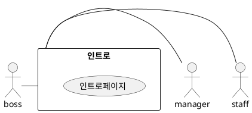
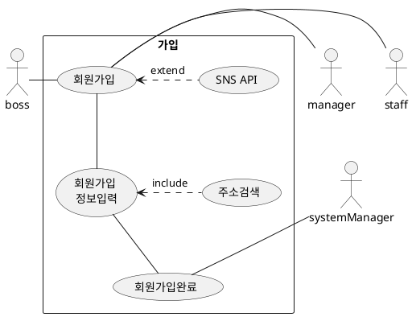
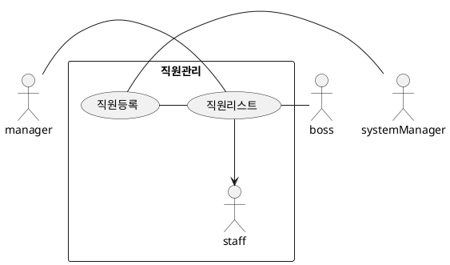
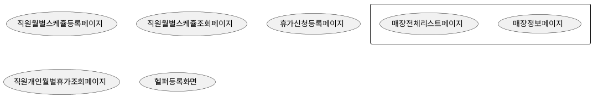
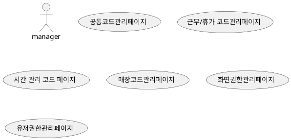
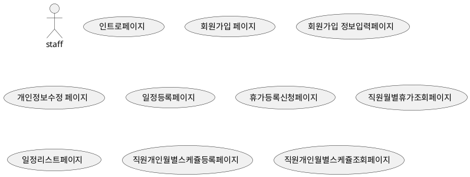
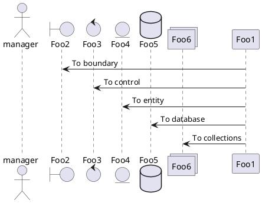

### intro

```plantuml
@startuml

actor boss

actor manager

actor staff
rectangle 인트로{

boss - 인트로  

manager - 인트로

staff - 인트로

usecase (인트로페이지)

}
@enduml
```
### 회원가입

```plantuml
@startuml

actor boss

actor manager

actor staff

actor systemManager

rectangle 가입 {

  boss - (회원가입)

  manager - (회원가입)

  staff - (회원가입)

  (회원가입)

  (회원가입) <. (SNS API) : extend

  (회원가입) -- (회원가입 \n정보입력)

  (회원가입 \n정보입력) <. (주소검색) : include

  (회원가입 \n정보입력) -- (회원가입완료)

  systemManager -- (회원가입완료)

}

@enduml
```
### 직원관리

```plantuml
@startuml
actor manager

actor boss

actor systemManager

rectangle 직원관리{

manager - (직원리스트)

boss - (직원리스트)

systemManager - (직원등록)

(직원등록) - (직원리스트)

(직원리스트) --> staff

}

@enduml
```

```plantuml

@startuml

rectangle {

  (매장정보페이지)

  (매장전체리스트페이지)

}

(직원월별스케쥴등록페이지)

(직원월별스케쥴조회페이지)

(휴가신청등록페이지)

(직원개인월별휴가조회페이지)

(헬퍼등록화면)

@enduml
```

### 관리자페이지

```plantuml

@startuml

actor manager

(공통코드관리페이지)

(근무/휴가 코드관리페이지)

(시간 관리 코드 페이지)

(매장코드관리페이지)

(화면권한관리페이지)

(유저권한관리페이지)

@enduml

```

### 직원

```plantuml

@startuml

actor staff

(인트로페이지)

(회원가입 페이지)

(회원가입 정보입력페이지)

(개인정보수정 페이지)

(일정등록페이지)  

(휴가등록신청페이지)

(직원월별휴가조회페이지)

(일정리스트페이지)

(직원개인월별스케쥴등록페이지)

(직원개인월별스케쥴조회페이지)

@enduml
```

```plantuml
@startuml
actor manager
boundary Foo2
control Foo3
entity Foo4
database Foo5
collections Foo6
Foo1 -> Foo2 : To boundary
Foo1 -> Foo3 : To control
Foo1 -> Foo4 : To entity
Foo1 -> Foo5 : To database
Foo1 -> Foo6 : To collections
@enduml
```
