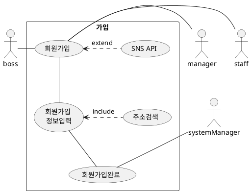
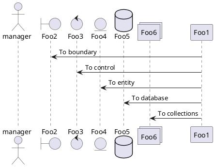

### 회원가입

```plantuml
@startuml

actor boss

actor manager

actor staff

actor systemManager

rectangle 가입 {

  boss - (회원가입)

  manager - (회원가입)

  staff - (회원가입)

  (회원가입)

  (회원가입) <. (SNS API) : extend

  (회원가입) -- (회원가입 \n정보입력)

  (회원가입 \n정보입력) <. (주소검색) : include

  (회원가입 \n정보입력) -- (회원가입완료)

  systemManager -- (회원가입완료)

}

@enduml
```

```plantuml
@startuml
actor manager
boundary Foo2
control Foo3
entity Foo4
database Foo5
collections Foo6
Foo1 -> Foo2 : To boundary
Foo1 -> Foo3 : To control
Foo1 -> Foo4 : To entity
Foo1 -> Foo5 : To database
Foo1 -> Foo6 : To collections
@enduml
```
