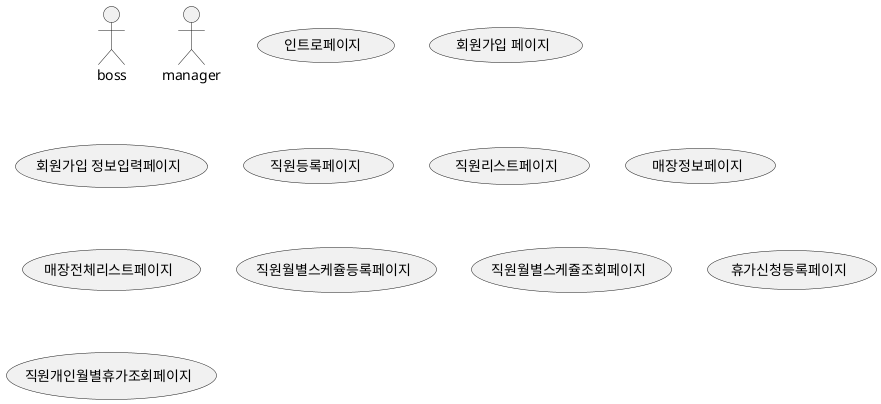
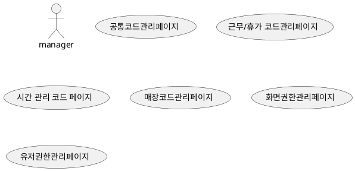
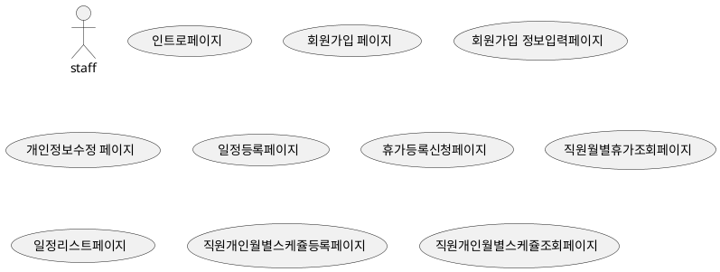
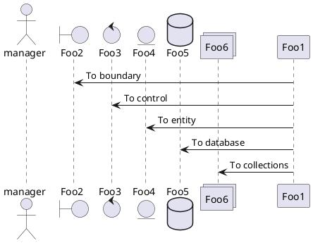

### 사용자 / 관리자

```plantuml
@startuml

actor boss

actor manager

(인트로페이지)

(회원가입 페이지)

(회원가입 정보입력페이지)

(직원등록페이지)  

(직원리스트페이지)

(매장정보페이지)

(매장전체리스트페이지)

(직원월별스케쥴등록페이지)

(직원월별스케쥴조회페이지)

(휴가신청등록페이지)

(직원개인월별휴가조회페이지)

@enduml
```

### 관리자페이지

```plantuml

@startuml

actor manager

(공통코드관리페이지)

(근무/휴가 코드관리페이지)

(시간 관리 코드 페이지)

(매장코드관리페이지)

(화면권한관리페이지)

(유저권한관리페이지)

@enduml

```

### 직원

```plantuml

@startuml

actor staff

(인트로페이지)

(회원가입 페이지)

(회원가입 정보입력페이지)

(개인정보수정 페이지)

(일정등록페이지)  

(휴가등록신청페이지)

(직원월별휴가조회페이지)

(일정리스트페이지)

(직원개인월별스케쥴등록페이지)

(직원개인월별스케쥴조회페이지)

@enduml

```

```plantuml
@startuml
actor manager
boundary Foo2
control Foo3
entity Foo4
database Foo5
collections Foo6
Foo1 -> Foo2 : To boundary
Foo1 -> Foo3 : To control
Foo1 -> Foo4 : To entity
Foo1 -> Foo5 : To database
Foo1 -> Foo6 : To collections
@enduml
```
