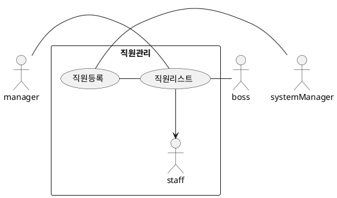

### 직원관리

```plantuml
@startuml
actor manager

actor boss

actor systemManager

rectangle 직원관리{

manager - (직원리스트)

boss - (직원리스트)

systemManager - (직원등록)

(직원등록) - (직원리스트)

(직원리스트) --> staff

}

@enduml
```
