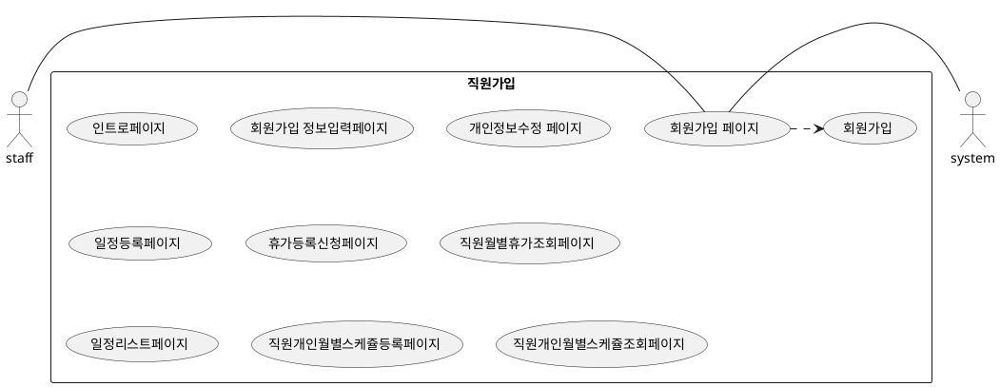

### 직원

```plantuml

@startuml

actor staff

actor system

rectangle 직원가입{

  staff - (회원가입 페이지)

  system - (회원가입 페이지)

  (인트로페이지)

  (회원가입 페이지) .> (회원가입)

  (회원가입 정보입력페이지)  

  (개인정보수정 페이지)

  (일정등록페이지)  

  (휴가등록신청페이지)

  (직원월별휴가조회페이지)

  (일정리스트페이지)

  (직원개인월별스케쥴등록페이지)

  (직원개인월별스케쥴조회페이지)

}


@enduml
```
